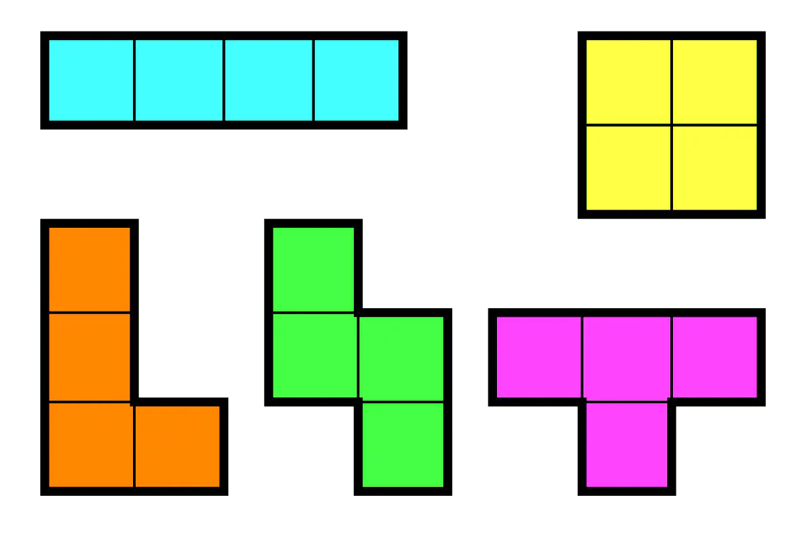
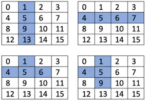
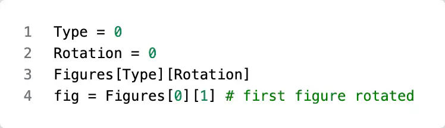
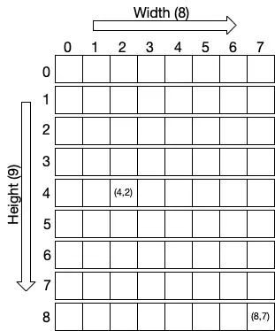
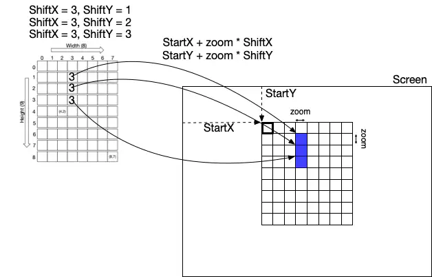

# Course Project: Tetris 1  (Data Structure and Mapping)

---

> - In this course project, we use the Tetris game as an example of improving software design.
> - From the prototype-level software, students refactor and redesign it into a high-quality, well-designed application ready to respond to users' requests.

---

## 1. Tetris Prototype

- When we build an application, we don't know exactly what we don't know yet.
- So, we start building a prototype to understand the application.
- We encounter many problems and solve them one by one.

---

### Prototype to know unknowns

- As a result, the prototype is barely working.
- But it is hard to add features or fix bugs with the software without a design.
- It is likely to add more bugs when we fix bugs.

---

### Tetris as a prototype

- In this course project, we mimic the situation of building a barely working Tetris prototype.
- It has no design, but simple data structures and algorithms to implement the game Tetris.

---

### Prototype to product through design

- At the end of the discussion, students are ready to refactor existing code into the designed code.
- The refactored code should easily add features to and fix bugs.

---

### Code smells

- When building a prototype, we sometimes make code that smells.
- After the prototype building, we should refactor the code to remove the code smells.

---

### The new age of coding

- LLM/AI is a great coder and smells bad code well.
- Discussing with LLM/AI to refactor the code is a good idea and fun.

---

#### Vibe coding to make a prototype

- Don't forget that we are software engineers who solve problems by making software.
- When LLM/AI makes the code, there is no meaning in knowing what we didn't know.
- It is dangerous when you can't follow what LLM/AI generated.

---

- LLM/AI can be a great coding partner (only) when you know what you're doing.
- LLM/AI is a great coder and tester who can save you time by giving you more time to solve problems.

---

- As problem solvers, we must take the lead and use LLM/AI as a tool.
- It will open a whole new way of solving problems when you do the design/architecture, and LLM/AI does the rest.
- Otherwise, it is a disaster for software engineers who can only code.

---

## 2. Tetris: Data Structure

- Colors
- Figures
- Field

---

### Color representation

- Any color can be represented with RGB information.

```python
BLACK = (0, 0, 0)
WHITE = (255, 255, 255)
GRAY = (128, 128, 128)
```

---

#### A Series of Colors

- We can define a series of Colors.

```python
Colors = [
    (0, 0, 0), # We don't use this 
    (120, 37, 179),
    (100, 179, 179),
    (80, 34, 22),
    (80, 134, 22),
    (180, 34, 22),
    (180, 34, 122),
]
```

---

##### Code smell

- When we use a list in a program, it implies that we will add more elements dynamically.
- However, the Colors array is constant, so this is a code smell: Use immutable objects whenever necessary.
- In Python, use the tuple `()` to efficient memory usage.

---

- When a value is constant, the name should be all capitalized.
- Using a number instead of a name is always a bad idea.

```python
PRIMARY_PURPLE = (120, 37, 179)
ACCENT_TEAL = (100, 179, 179) 

COLORS = (PRIMARY_PURPLE, ACCENT_TEAL)
```

---

### Figure representation

- Five figures (tetrominos)
- Figure array

---

#### Five figures (tetrominos)
<!--
- Tetris has five figures called tetrominos. 


-->

<div style="display: flex; gap: 0em; align-items: stretch;">
    <div style="flex: 0 0 60%;font-size: 1em;">
    <ul>
      <li>Tetris has five figures called tetrominos.</li>
    </ul>
  </div>
  <div style="flex: 0 0 40%;display: flex;justify-content: center; align-items: center;">
    
  </div>
</div>

- To represent the figure, we need a 4 x 4 matrix.

---

- However, we can use an array to represent the same information.
<!--
- For example, [1,5,9,3] represents a vertical figure.


-->

<div style="display: flex; gap: 0.5em; align-items: stretch;">
    <div style="flex: 0 0 60%;font-size: 1em;">
    <ul>
      <li>For example, [1,5,9,3] represents a vertical figure, and [4,5,6,7] a horizontal one.</li>
    </ul>
  </div>
  <div style="flex: 0 0 40%;display: flex;justify-content: center; align-items: center;">
    
  </div>
</div>

---

- We can use an array of arrays to represent a figure and its rotation.
- In this example, [4,5,6,7] is the rotation of [1,5,9,13].

```python
[[1, 5, 9, 13], [4, 5, 6, 7]]
```

---

- We can have a figure array of arrays to store all the figures and their rotations.

```python
Figures = [
    [[1, 5, 9, 13], [4, 5, 6, 7]],
    [[4, 5, 9, 10], [2, 6, 5, 9]],
    [[6, 7, 9, 10], [1, 5, 6, 10]],
    [[1, 2, 5, 9], [0, 4, 5, 6], [1, 5, 9, 8], [4, 5, 6, 10]],
    [[1, 2, 6, 10], [5, 6, 7, 9], [2, 6, 10, 11], [3, 5, 6, 7]],
    [[1, 4, 5, 6], [1, 4, 5, 9], [4, 5, 6, 9], [1, 5, 6, 9]],
    [[1, 2, 5, 6]],
]
```

---

##### Code smell

- The code still uses a list when we have no plan to change its size.
- This violates the "Use immutable objects whenever necessary" rule.

```python
((1,5,9,13), (4,5,6,7)) ...
```

---

#### Selecting the Figure

- We can use two variables, Type and Rotation, to select the figure (tetromino) and its rotation.
  - For example, Figures[0] is the first figure, and Figures[1] is the second figure.

---

- `Figures[Type][0]` is the figure not rotated, `Figures[Type][1]` is the first rotation, and `Figures[Type][2]` is the next rotation.

<!--
```python
Type = 0
Rotation = 0
Figures[Type][Rotation]
fig = Figures[0][1] # first figure rotated
```
-->



---

### Field

- The Field contains the Width $\times$ Height blocks.
  - In this example, we have an 8 $\times$ 9  Field.



---

- To access the 2D list, we should specify the Y first, then X.
- For example, the last box in the 2D list is in `Field[8][7]`, which means $9^{th}$ row and $8^{th}$ column.
- We use two global variables Shift\_X and Shift\_Y to specify the location in the Field in this program.

---

- We need Width and Height variables to specify the x and y dimensions of the Field.
- Global variables, StartX and StartY, specify where the Field is drawn on the screen.
- If these values are (0, 0), the Field will be drawn on the left-upper side of the screen.

---

#### Global variables

```python
Type = 0
Color = 0
Rotation = 0
State = "start" # or "gameover"
Field = []
Height = 0 # Tetris block Height and Width
Width = 0
StartX = 100 # StartX/Y position in the screen
StartY= 60
# Block size
Tzoom = 20 
ShiftX = 0 # Shift left/right or up/down
ShiftY = 0
```

---

##### Code smell

<style scoped> code:not(pre code) { background: #e2e8f0; padding: 4px 8px !important; border-radius: 4px; font-weight: bold !important; color: #1e40af; border: 1px solid #cbd5e1; } </style>.

- It's always a bad idea to use global variables.
- It is a direct violation of the OOP `Encapsulation` rule.
- Instead, use a class to abstract and encapsulate.

---

##### Code smell

<style scoped> code:not(pre code) { background: #e2e8f0; padding: 4px 8px !important; border-radius: 4px; font-weight: bold !important; color: #1e40af; border: 1px solid #cbd5e1; } </style>.

- Do not use a shortened name unless it is a well-known name.
- It is not easy to understand what `Tzoom` means.
- Use a more descriptive name for a variable.

```python
Tzoom
```

---

### Initialization

- This is the way to make a list of N elements.
- We make a list of 5 elements (all 0).

```python
[0] * 5 # [0, 0, 0, 0, 0]
```

---

- Then, we use the append method to add the generated 1D list to the Field list Height times.

```python
for i in range(Height):
    new_line = [0] * Width 
    Field.append(new_line)
```

---

#### Python Pitfall

- As we can make a list using the * operator, we may think we can make a list of a list with it; This is a bug that is hard to find in Python.
- Because it is a reference duplication, not a real value.

```python
[0] * 5 # [0, 0, 0, 0, 0] OK
[[0,0,0,0,0]] * Height # Bug! If you don't know what you are doing
```

---

- This is one of the reasons why we should know what we are doing.

```python
# DANGEROUS - creates 3 references to the SAME list
matrix = [[0, 0, 0]] * 3  # [[0,0,0], [0,0,0], [0,0,0]]
print("Before:", matrix)  # [[0,0,0], [0,0,0], [0,0,0]]

matrix[0][1] = 99
print("After:", matrix)   # [[0,99,0], [0,99,0], [0,99,0]]
# ALL rows changed because they're the same object!
```

---

##### Code smell

- We used a for loop to avoid this issue; However, the better solution is to use Python list comprehension.
- Use a simpler solution to solve the same problem.

<style scoped>
pre code { font-size: 0.7em !important; line-height: 1.2;}
</style>

```python
for i in range(Height): # our solution
    new_line = [0] * Width 
    matrix.append(new_line)
    
matrix = [[0] * Width for _ in range(Height)] # better
```

---

## 3. Tetris: Mapping

> Mapping Logical Location to Physical Point


---

### Logical to Physical

<style scoped>
li { font-size: 0.99em !important; line-height: 1.2;}
</style>

- The Field 2D array is a logical concept that needs to be mapped to a screen.
- As an example, Field[Y][X] maps to the location at (StartX, StartY):(StartX + zoom *X, StartY + zoom* Y).

---
<style scoped>
li { font-size: 0.8em !important; line-height: 1.2;}
</style>

- Field[0][0] -> (StartX, StartY):(StartX + zoom *1, StartY + zoom* 1).


---

### Drawing a board

- We can use this mapping rule to draw a board on the screen.
- We use `pygrame.draw.rect` to draw rectangles with the Gray color.

```python
for i in range(Height): # i means Y direction
  for j in range(Width): # j means X direction
    pygame.draw.rect(screen, GRAY, 
      [x + zoom * j, y + zoom * i, zoom, zoom], 1)
```

---

- The logical locations "i and j" in Field[i][j], where i matches the y (ShiftY) coordinate, and j matches the x (ShiftX) coordinate.
<!--
- For example, if there are figures at Field[1][3], Field[2][3], and Field[3][3], the ShiftX and ShiftY are used to locate the position in the Field. 


-->
<div style="display: flex; gap: 0.5em; align-items: stretch;">
    <div style="flex: 0 0 60%;font-size: 1em;">
    <ul>
      <li>For example, with Field[1][3], [2][3], and [3][3], the ShiftX and ShiftY can locate the position.</li>
    </ul>
  </div>
  <div style="flex: 0 0 40%;display: flex;justify-content: center; align-items: center;">
    
  </div>
</div>

---

- The Field[1][3] is mapped to (StartX + zoom *3, StartY + zoom* 1, zoom, zoom) in the screen and on.

   

---

### Drawing a rectangle

- We can write the algorithm to draw a rectangle using this mapping rule.

```python
if Field[i][j] > 0:
  pygame.draw.rect(screen, # screen
    Colors[Field[i][j]], # color
    [x + zoom * j + 1, # 
     y + zoom * i + 1, # 
     zoom - 2, # 
     zoom - 2]) #
```

---

#### Visual borders

- In the code, we add +1 and -2; this is a common technique in pygame for creating **visual borders** between grid elements.

<style scoped>
pre code { font-size: 1.5em !important; line-height: 1.0em;}
</style>

```text
Without borders:        With +1 and -2 borders:
┌────────────────────┐   ┌────────────────────┐
│████████████████████│   │ ┌────────────────┐ │
│████████████████████│   │ │████████████████│ │
│████████████████████│   │ │████████████████│ │
│████████████████████│   │ │████████████████│ │
│████████████████████│   │ └────────────────┘ │
└────────────────────┘   └────────────────────┘
     20×20 pixels           18×18 pixels + 1px border
```

---

### Drawing a figure

- Drawing a figure on the board is drawing rectangles with the color using the image list.
- It must use the shift\_x and shift\_y variables to shift the figure's location.

---

#### Drawing a figure from an image

- We can draw the figure at (x, y) from the image.

```python
image = [1, 5, 9, 13]
...
for i in range(4):
  for j in range(4):
    p = i * 4 + j
    if p in image:
      pygame.draw.rect(screen, Colors[Color],
          [x + zoom * (j + shift_x) + 1, y + zoom * (i + shift_y) + 1,
           zoom - 2, zoom - 2]
      )
```
