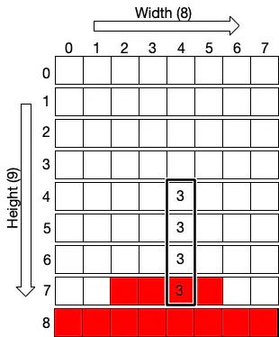

# Course Project: Tetris 2  (Service functions, algorithms, and added features)

---

## 4. Service functions
>
In this section, we discuss service functions for the Tetris game algorithm.
> - Understanding what service functions do is essential.
>
---

### Random figure generation

- We can randomly select a figure and color.

```python
Figures = [[[1, 5, 9, 13], [4, 5, 6, 7]], ...]
Colors = [
  (0, 0, 0), # We don't use this 
  (100, 179, 179), ... (180, 34, 122),
]
...
Type = random.randint(0, len(Figures) - 1)
Color = random.randint(1, len(Colors) - 1)
```

---

#### Making a new figure

- Initialize the figure, color, ShiftX, ShiftY, and Rotation.

```python
def make_figure(x, y):
    global ShiftX, ShiftY, Type, Color, Rotation
    ShiftX = x
    ShiftY = y
    Type = random.randint(0, len(Figures) - 1)
    Color = random.randint(1, len(Colors) - 1)
    Rotation = 0
```

---

### Breaking lines

- When a row in the Field is filled, we should remove the line.
- We find the filled line by counting empty cells.
- When it is zero, we remove the row by copying all the previous rows one by one

---

```python
def break_lines():
    global Field
    for i in range(1, Height):
        zeros = 0
        for j in range(Width):
            if Field[i][j] == 0:
                zeros += 1
        # there is no empty cell
        if zeros == 0:
            for k in range(i, 1, -1):
                for j in range(Width):
                    Field[k][j] = Field[k - 1][j]
```

---

#### Code smell

- Why is it to read code?
- In this case, we can make subfunctions for readability

```python
for i in ...
  is_filled = check_row_filled(...)
  if is_filled:
    delete_row(...)
```

---

### Finding intersections

- The ShifX and ShiftY are updated from the user's keyboard action.
  - We need to check if the new figure locations are zero (empty) or not (intersection).
  - We also need to check if the new figure hits the left or right wall.

---

#### Intersect with existing figures
<!-- 
- If the new Field[i + ShiftY][j + ShiftX] is not zero, it means that the figure hits one of the blocks.


-->
<div style="display: flex; gap: 0.5em; align-items: stretch;">
    <div style="flex: 0 0 60%;font-size: 1em;">
    <ul>
      <li>If the new Field[i + ShiftY][j + ShiftX] is not zero, it means that the figure hits one of the blocks.</li>
    </ul>
  </div>
  <div style="flex: 0 0 40%;display: flex;justify-content: center; align-items: center;">
    
  </div>
</div>

```python
if Field[i + ShiftY][j + ShiftX] > 0:
  intersection = True
```

---

#### Hit the walls
<!--

- We must check if the figure hits the right or left wall.


-->

<div style="display: flex; gap: 0.5em; align-items: stretch;">
    <div style="flex: 0 0 60%;font-size: 1em;">
    <ul>
      <li>We must check if the figure hits the right or left wall.</li>
    </ul>
  </div>
  <div style="flex: 0 0 40%;display: flex;justify-content: center; align-items: center;">
    
  </div>
</div>

```python
 if i + ShiftY > Height - 1 or \
    j + ShiftX > Width - 1 or \
    j + ShiftX < 0:
        intersection = True
```

---

```python
def intersects(image):
    intersection = False
    # code smell - what is 4? Magic number
    for i in range(4):
        for j in range(4):
            if i * 4 + j in image:
                if i + ShiftY > Height - 1 or \
                   j + ShiftX > Width - 1 or \
                   j + ShiftX < 0 or \
                   Field[i + ShiftY][j + ShiftX] > 0:
                       intersection = True
    return intersection
```

---

#### Code smells

- What is 4? The magic number should be replaced with a meaningful name.
- It's confusing, why is Y related to i and X related to j? Y should be related to j, and X to i.

---

### Freeze

- The figure moves downward when users click the down button or the space button.
- In this case, if the intersection happens, the figure hits the bottom or any existing blocks.
- Freeze is when the game is in this condition (drop and hit something).

---

- In the freeze condition, we do the following actions.
  - We check if we have any lines to break.
  - The figure is dropped, so we make a new figure.
  - If the new figure intersects with anything, it means the game is over: we should stop the game by making the State ``gameover.''

---

```python
def freeze(image):
    global Field, State
    for i in range(4):
        for j in range(4):
            if i * 4 + j in image:
                Field[i + ShiftY][j + ShiftX] = Color
    break_lines()
    make_figure(3, 0) 
    if intersects(Figures[Type][Rotation]):
        State = "gameover"
```

---

#### Code smell

- Can you guess what it does from the name freeze?
- Why are there no comments on what it does, how, and why?

---

### Moving Tetris Figures

- Users click the right or left button.
- The go_side function is fused for this action.

```python
def go_side(dx):
  global ShiftX
  old_x = ShiftX; ShiftX += dx
  if intersects(Figures[Type][Rotation]):
    ShiftX = old_x
```

---

#### Down

- The go_down function is for the user's down key action.

```python
def go_down():
  global ShiftY
  ShiftY += 1
  if intersects(Figures[Type][Rotation]):
    ShiftY -= 1 
    freeze(Figures[Type][Rotation])
```

#### Drop (space button)

- The go_space function is for the user's space key action.

```python
def go_space():
  global ShiftY
  while not intersects(Figures[Type][Rotation]):
    ShiftY += 1
  ShiftY -= 1
  freeze(Figures[Type][Rotation])
```

---

### Rotating Tetris figures

- Rotating a figure means increasing the Rotation value and redrawing the figure.
- If the Rotation value is more than the length of the element, we rotate it back to 0.

---

```python
def rotate():
  global Rotation
  def rotate_figure():
    global Rotation
    Rotation = (Rotation + 1) % len(Figures[Type])
        
  old_rotation = Rotation
  rotate_figure()
  if intersects(Figures[Type][Rotation]):
    Rotation = old_rotation
```

---

#### Code smell

- It is easier to read than the freeze function as it uses the subfunction.  
- We should modularize code as much as possible for readability and upgradability.

---

## 5. Algorithm
>
Now that we have the service functions, we can implement the algorithm using these functions.

---

### State Design Pattern

- Tetris uses the State Design pattern; it has two states, "start" and "gameover": The initial state is "start".

```python
def initialize(height, width):
    global Height, Width, Field, State
    Height = height
    Width = width
    Field = []
    State = "start"
    init_board()
```

---

- The state becomes "gameover" in the freeze method when the new figure intersects existing blocks as soon as it is made.

```python
def freeze(image):
  ...
  make_figure(3, 0) 
  if intersects(Figures[Type][Rotation]):
    State = "gameover" 
```

---

### main algorithm

This is a simplified Tetris main loop.

```python
State = "start"; 
done = False
while not done:
  for event in pygame.event.get(): 
    # Keyboard processing
    ...
    
  if State == "gameover": 
    done = True
```

---

#### Controlling Screen Refresh Speed

<style scoped>
li { font-size: 0.98em !important; line-height: 1.2;}
</style>

- We should control how the Tetris screen is updated.
- We can use the clock.tick function to control the screen refresh speed.
- The clock.tick function controls the screen refresh speed using the fps (frames per second) variable.
- The screen is refreshed using the flip function.  

---

```python
def main():
  pygame.init()
  clock = pygame.time.Clock()
    
  fps = 25
  while not done:
    ...
  # refresh the screen
  pygame.display.flip()
  clock.tick(fps)   
```

---

#### Controlling Game Speed

- We can control the figure to move fast or slow using the counter and fps variable.
- When (counter % value) == 0, the figure can go down.
- We can control the level variable to control the speed of making (counter % value) to be 0.

---

```python
while not done:
  counter += 1
  if counter > 100000: counter = 0

  if counter % (fps // 2 // level) == 0:
    if State == "start":
      go_down()
```

---

#### Controlling Keyboard Action

- This is the skeleton code of keyboard controller action.
- When users use keyboard or mouse, the pygame.event.get function returns an event.
- We can parse the event and process it accordingly.

---

```python
for event in pygame.event.get():
    if event.type == pygame.QUIT:
        done = True
    if event.type == pygame.KEYDOWN:
        if event.key == pygame.K_UP: rotate()
        if event.key == pygame.K_LEFT: go_side(-1)
        if event.key == pygame.K_RIGHT: go_side(1)
        if event.key == pygame.K_SPACE: go_space()
        if event.key == pygame.K_DOWN: 
            pressing_down = True
    if event.type == pygame.KEYUP 
       and event.key == pygame.K_DOWN:
        pressing_down = False
```

---

##### Automatic go down

- We can implement automatic go down if time is up or if users press the down button.

```python
# Check if we need to go down automatically
if counter % (fps // 2 // level) == 0 or pressing_down: 
    if State == "start":
        go_down()
```

---

#### Quit button

- When users click the close button in the window, pygame.QUIT event is generated.
- In this case, we stop the game by making the done variable True.

```python
for event in pygame.event.get():
  if event.type == pygame.QUIT:
    done = True
```

---

## Added Features (tetris_ver2.py)

> The tetris_ver1.py is too simplistic, and we need to add more features.

---

### Displaying Score

- When users break lines, the score is updated.
- We display the score information on the screen.

```python
def break_lines():
  Score += lines ** 2 

text = font.render("Score: " + str(Score), True, BLACK)
screen.blit(text, [0, 0])
```

---

### Displaying Information When Quit

```python
if State == "gameover":
  font1 = pygame.font.SysFont('Calibri', 65, True, False)
  text_game_over = font1.render("Game Over", True, (255, 125, 0))
  text_game_over1 = font1.render("Enter q to Quit", True, (255, 215, 0))        
  screen.blit(text_game_over, [20, 200])
  screen.blit(text_game_over1, [25, 265])
```

---

## Think

- We can add any features.
- However, as the implementation is not designed at all, it will be harder to add features.
- The code has many code smells that need to be refactored.

---

- For the rest of this course, we will learn software design, including the following to resolve the issue:
  - OOP & SOLID
  - Design patterns
  - Code smells & refactoring
  - Software Architecture
